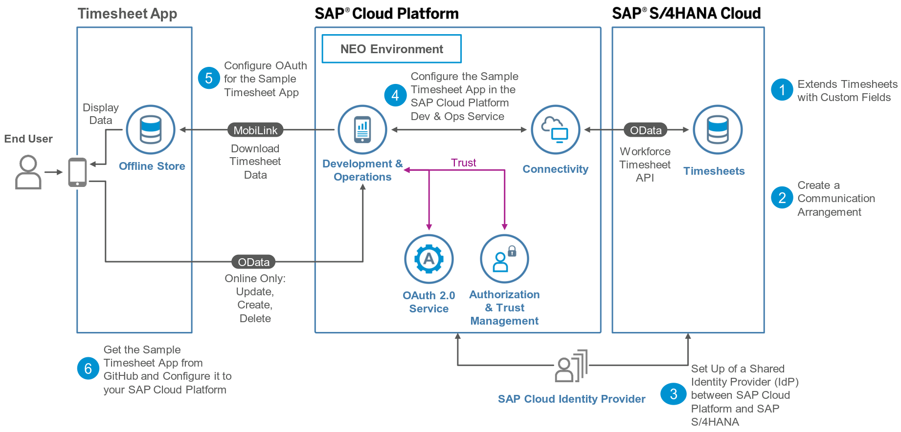

# S/4HANA Cloud extensions – Native iOS Offline Timesheet App

This extensibility scenario showcases the Native iOS Offline Timesheet app, which can be referred to as an alternative – or even an addition – to the standard Manage My Timesheet SAP S/4HANA Cloud time recording app. With this alternative app, your employees can record their working times on their iOS devices. Each recorded task includes start and end times, a recording date, and a task type (predefined with some sample tasks). With the app, you can create, update, or delete working times (internet connection required). Additionally, the app leverages offline capabilities which makes it possible for employees to access their existing timesheet records on their mobiles devices even if there's no internet connection.

> **NOTE:** This sample app is based on and explained in detail in the Mobile Extensibility set-up instructions guide. There, you will find more details on the end to end steps of the Reading the Product details from S/4HANA system and showing it on IOS application, e.g.:
> *    Connection setup of the SAP S/4HANA Cloud system and SAP Cloud Mobile Services Platform (via a Communication Arrangement and Destination)
> *    Adaption of the sample app

Set-up Instructions Guide
-------------
https://help.sap.com/viewer/80ceaf9e74574004873d675445e0ec84/SHIP/en-US

What do I need for this Scenario?
-------------
At one glance you need to match the following listed prerequisites for this scenario:

1. We assume that you have access to an **SAP S/4HANA Cloud** system, and an **SAP Cloud Platform** account.
2. An **SAP Cloud Platform Identity Authentication tenant** is required to enable the an SSO Authentication with the Business User.
3. A **Mac Device** with **Xcode 9.3** and **SAP iOS SDK**.
5. This sample application reads data from the SAP S/4HANA Cloud backend system and hence requires **appropriate backend data** to be maintained there.

All prerequisites are described in detail in the setup guide. The preparation and the complete end to end Setup is described detailed by the guide.

Development Environment on Mac Device
-------------
This sample app is based on the following tool versions:
1. Xcode version: **9.3 (9E145)**
2. Programming language: **Swift 4**
3. SAP iOS SDK version: **2.2.101** (Xcode 9.2 - 9.4 2.0SP02_PL01)

> **NOTE:**
> In case you are using another version of Xcode, then stated here, it is possible to download from Apple’s Developer website https://developer.apple.com/downloads/index.action?name=Xcode (Apple ID required) any version of the Xcode IDE. That downloaded version can be used parallel to your version.

Information about the generated Code parts of this Application
-------------
This sample is based on a generated application. More information about the structure of the generated application can be found on help.sap.com:
https://help.sap.com/viewer/fc1a59c210d848babfb3f758a6f55cb1/Latest/en-US/c14683672e9d4df383e8fced4ea9a019.html

Focal points of this sample app
-------------
* Extends the S/4HANA Cloud system with the aid of SAP Cloud Platform SDK for iOS
* The application is able to run in an offline mode, which allows to read the data without an internet connection
* Create, Update and Delete operations are only in the online mode possible
* The standard Workforce Timesheet API is used for the back-end
* Basic Authentication between S/4HANA Cloud system and the SAP Cloud Platform
* OAuth2 Authentication between SAP Cloud Platform and the Sample App
* Single Sign-Sn (SSO) access enabled, to use your S/4 HANA Cloud Employee as Business User for Authentication

Overview about the app's and system landscape Architecture
-------------

Troubleshooting
-------------
Check out the Troubleshooting section, which handles some known issues for this scenario: [Troubleshooting](Troubleshooting.md).

Limitations / Disclaimer
------------------------
Note: This sample code is primarily for illustration purposes and is not intended for productive usage. It solely shows basic interaction with an S/4HANA Cloud system. Topics like authentication, error handling, transactional correctness, security, caching, tests were omitted on purpose for the sake of simplicity. For detailed information on development on the SAP Cloud Platform, please consult https://cloudplatform.sap.com/developers.html

How to obtain support
---------------------
File a message in the [SAP Support Launchpad](https://launchpad.support.sap.com/#/incident/create) under component `CA-GTF-FND-EXT`

Copyright and License
---------------------

Copyright (c) 2017 SAP SE or an SAP affiliate company. All rights reserved.
This file is licensed under the Apache Software License, v. 2 except as noted otherwise in the [LICENSE](LICENSE) file

http://www.apache.org/licenses/LICENSE-2.0

Unless required by applicable law or agreed to in writing, software distributed under the License is distributed on an "AS IS" BASIS, WITHOUT WARRANTIES OR CONDITIONS OF ANY KIND, either express or implied. See the License for the specific language governing permissions and limitations under the License.
